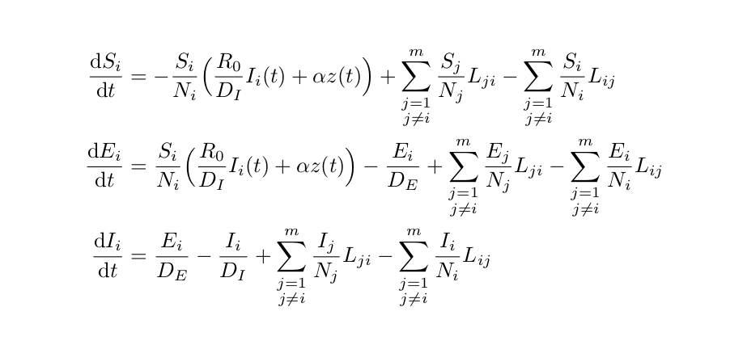

# EpiCoronaHack 2020 - Team Quarantine (transmission)

## Team Member:

* David Cameron (BC Cancer)
* Brandon Chan (BC Cancer)
* Rebeca Cardim Falcao (UBC)
* Sarafa Iyaniwura (UBC)
* Mechthild Kellas-Dicks 
* Liangchen Liu (UBC)
* Stephen Zhang (UBC)

## Team Aim:

* Build a ODE metapopulation model for different regions 
  * without  quarantine
  * with quarantine 
* Use numerical simulation (in Python) to determine the effect of different intervention strategies on local outbreak prevention and control; (Perhaps) BCCDC professionals can determine the most effective and economical  control measures based on this. 
* Develop visualization tools to aid in model parameter investigation, selection, and outcomes. 
* The tools can be used to investigate the sensitivity of the parameters of the model.

## Team Progress:

We already have the (primary) model, we coded it up, we nunmerically solved the systems of ODEs and ran simulations based on some made-up data (Team Flight we need you!), and we have the visualization!

## The mathematical models

We develop two ODE metapopulation models to study the population dynamics of the COVID-19 virus in five different connected regions. We assume Wuhan as the region of the stert of the outbreak. The virus is introduced in the human population through a zoonotic force of infections z(t), which we estimate from the first infections on humans from animals. The connection between the 5 different regions should be studied from travels data: road, sea and air. Here, we only consider the latter, and we use real flight data, and simulated data of flight data.

* ### Without quarantine

* ### With quarantine

# Flight data

